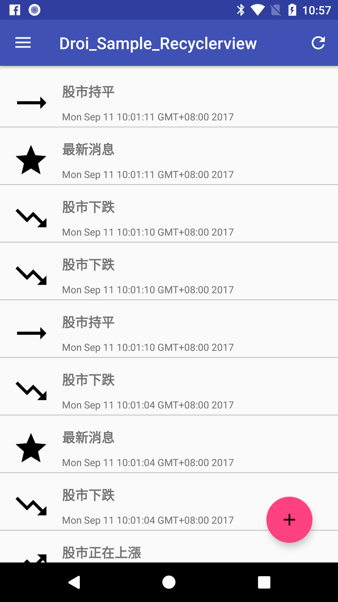
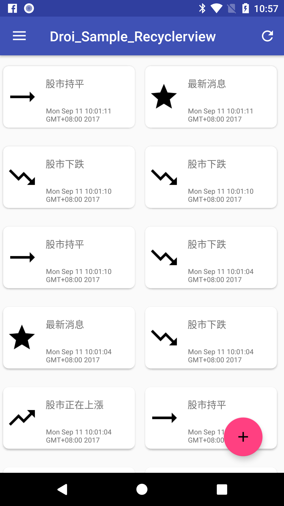

# Recyclerview with DroiBaaS
## 前言

在Android上,常需要把相同類別的資料用ListView的方式呈現, 例如新聞列表, 電話聯絡人頁面, 甚至是SNS的資訊表達. 在這邊示範了RecyclerView這個進階版的ListView如何與DroiBaaS做整合, 同時提供了LinerLayout與GridLayout兩種呈現方式. 另外也會使用到第三方套件幫忙實現UI整合, 例如Buffer knife是用來幫忙整合View與按鍵事件, Glide是用來顯示圖片

### LinerLayout

### GridLayout


## 環境需求

* Android minSdkVersion: 22
* DroiBaaS CoreSDK: 1.1.+
* Buffer Knife: 8.8.1
* Glide: 3.8.0

## 元件
### layout
* data\_list.xml: 描述RecyclerView 以及 FloatingActionButton widget.

* data\_item.xml 針對單筆資料的LinearLayout.

* data\_item\_card.xml:  針對單筆資料的GridLayout.


### java
* MyFragment.java: 存放RecyclerView物件, 並設定Adapter來新增/更新從DroiBaaS新增及查詢到的資料
	- 在mRecyclerView設定Butter Knife的``@BindView``annotation, 並在OnCreateView把對應layout實現並使用Buffer Knife綁定.  
	
	``` java
	@BindView(R.id.list)
	RecyclerView mRecyclerView;
	   
	@Override
	public View onCreateView(LayoutInflater inflater, ViewGroup container, Bundle savedInstanceState) {
	    View view = inflater.inflate(R.layout.data_list, container, false);
	    ButterKnife.bind(this, view);
	    setHasOptionsMenu(true);
	
	    return view;
	}
	```
	
	- 在onViewCreated設置MyAdapter, 並抓取目前DroiBaaS上的資料. 若查詢成功(即DroiError.isOk為True)則更新資料到MyAdapter. ***DroiQuery***可以設置條件進行查詢物件並自動回存成您指定的``DroiObject``, 在這邊我們希望查詢回來是``News``class
	
	``` java
    @Override
    public void onViewCreated(View view, @Nullable Bundle savedInstanceState) {
        super.onViewCreated(view, savedInstanceState);

        // Determine the layout
        Bundle argument = getArguments();
        int layoutType = argument.getInt(Keywords.LAYOUT_TYPE);
        switch (layoutType) {
            case Constants.Layout_Grid:
                mLayoutManager = new GridLayoutManager(getContext(), 2);
                break;
            case Constants.Layout_Linear:
            default:
                mLayoutManager = new LinearLayoutManager(getContext());
                break;
        }

        mAdapter = new MyAdapter(layoutType);

        mRecyclerView.setHasFixedSize(true);
        mRecyclerView.setLayoutManager(mLayoutManager);
        mRecyclerView.setAdapter(mAdapter);

        refreshNews();
    }
    
    private void refreshNews() {
        long onedDayAgoMillis = System.currentTimeMillis() - ONE_WEEK_MILLY;
        Date oneDayAgoDate  = new Date(onedDayAgoMillis);
        DroiQuery query = DroiQuery.Builder.newBuilder().query(News.class).where(DroiCondition.gt("_CreationTime", oneDayAgoDate)).build();

        // Query and make sure check DroiError
        query.runQueryInBackground(new DroiQueryCallback<News>() {
            @Override
            public void result(List<News> list, DroiError droiError) {
                // Query successfull, then update result to adapter
                if (droiError.isOk()) {
                    Snackbar.make(getActivity().findViewById(R.id.coordinatorLayout), "Latest news count is " + list.size(), Snackbar.LENGTH_SHORT).show();
                    mAdapter.replaceNews(list);
                } else {
                    Snackbar.make(getActivity().findViewById(R.id.coordinatorLayout), "Fail to query, check DroiError/LOGCAT first." + list.size(), Snackbar.LENGTH_SHORT).show();
                    Log.d(LOG_TAG, "Fail to query and DroiError: " + droiError.toString());
                }
            }
        });
    }
	```
	
	- 設定Butter Knife的``@OnClick``annotation來綁定FloatingActionButton的點擊事件後, 當點擊事件發生則新增一筆News資料儲存到DroiBaaS, 若新增成功(即DroiError.isOk為True)則更新資料到MyAdapter. 
	
	``` java
    @OnClick(R.id.add)
    @SuppressWarnings("unused")
    public void onAddClick() {
        final News tmp = new News();
        tmp.type = rand.nextInt(4);
        tmp.titile = News.TYPE_STRS[tmp.type];
        tmp.saveInBackground(new DroiCallback<Boolean>() {
            @Override
            public void result(Boolean aBoolean, DroiError droiError) {
                if (aBoolean) {
                    mAdapter.AddNews(tmp);
                } else {
                    Snackbar.make(getActivity().findViewById(R.id.coordinatorLayout), "Fail to add news, check DroiError/Logcat first.", Snackbar.LENGTH_SHORT).show();
                    Log.d(LOG_TAG, "Fail to add news and DroiError: " + droiError.toString());
                }
            }
        });
    }
	```
	
	- 新增一個refresh menu item, 在該item被選取時, 執行更新news
	
	``` java
    @Override
    public void onCreateOptionsMenu(Menu menu, MenuInflater inflater) {
        MenuItem item =  menu.add(Menu.NONE, R.id.refresh_menu, 0, R.string.refresh);
        item.setShowAsAction(MenuItem.SHOW_AS_ACTION_IF_ROOM);
        super.onCreateOptionsMenu(menu, inflater);
    }

    @Override
    public boolean onOptionsItemSelected(MenuItem item) {
        if (item.getItemId() == R.id.refresh_menu) {
            refreshNews();
        }

        return super.onOptionsItemSelected(item);
    }
	
	```


  
    
    
	
	
* MyViewHolder.java: 繼承了RecyclerView.ViewHolder用來乘載每筆資料, 在這邊我們一樣使用Butter Knife來綁定View
	
	``` java
	class MyViewHolder extends RecyclerView.ViewHolder {
	    @BindView(R.id.itemImage)
	    public ImageView itemImage;
	
	    @BindView(R.id.itemHeader)
	    public TextView itemHeader;
	
	    @BindView(R.id.itemDate)
	    public TextView itemDate;
	
	
	    public MyViewHolder(View itemView) {
	        super(itemView);
	        ButterKnife.bind(this, itemView);
	    }
	}
	```
	
* MyAdapter.java: 繼承了RecyclerView.Adapter來描述如何呈現MyViewHolder. 我們使用了SortedList來幫助排序資料
	- 指定item layout
	
	``` java
    // Create new views (invoked by the layout manager)
	 @Override
    public MyViewHolder onCreateViewHolder(ViewGroup parent,
                                           int viewType) {
        // create a new view
        View v = null;
        if (mLayoutType == Constants.Layout_Linear) {
            v = LayoutInflater.from(parent.getContext())
                    .inflate(R.layout.data_item, parent, false);
        } else {
            v = LayoutInflater.from(parent.getContext())
                    .inflate(R.layout.data_item_card, parent, false);
        }

        return new MyViewHolder(v);
    }
	```
	
	- 根據資料的位置來更新ViewHolder的內容, 這邊另外用了Glide套件來顯示圖片
	 
	``` java
    // Replace the contents of a view (invoked by the layout manager)
    @Override
    public void onBindViewHolder(MyViewHolder holder, int position) {
        // - get element from your dataset at this position
        // - replace the contents of the view with that element
        News target = mSortedList.get(position);
        holder.itemHeader.setText(target.titile);
        holder.itemDate.setText(target.getCreationTime().toString());

        //Set image
        int resId = getResIdByType(target.type);
        Uri uri = ResourceHelper.getResourceUri(holder.itemImage.getResources(), resId);
        Glide.with(holder.itemImage.getContext()).load(uri).centerCrop().into(holder.itemImage);
    }
	```

 


