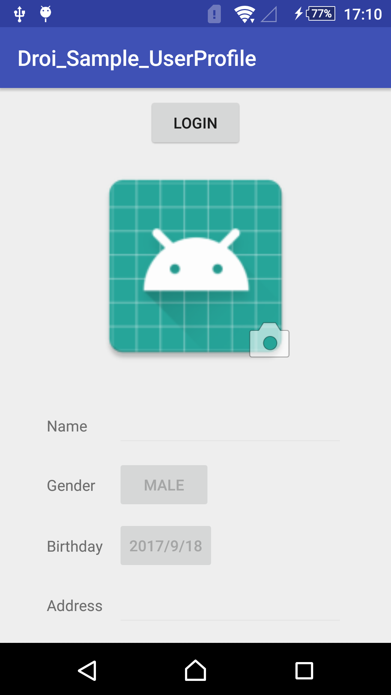
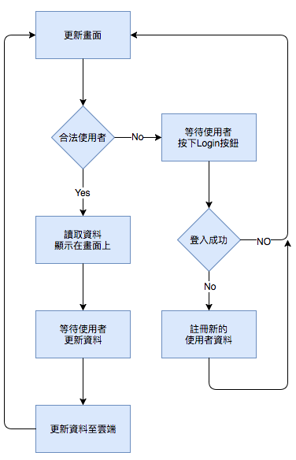

# Droi\_Sample\_UserProfile

`Droi_Sample_UserProfile`是個功能簡單的專案。主要示範如何使用自定義的`DroiUser`來完成延伸資料的載入及儲存。

## 專案架構


### 函式庫需求
* DroiBaaS - [DroiBaaS](https://www.droibaas.com)
* ButterKinfe - 一個方便控制UI的好3rd函數庫。[這裡](http://jakewharton.github.io/butterknife/)

*build.gradle*

```  
    // 使用APT工具产生辅助程序代码，需要使用Annotation Process Tool功能时添加，非必要
    annotationProcessor 'com.droi.sdk:annotationprocessor:+'
    
    // DroiCore SDK使用的3rd http函数库
    // Core SDK从1.1.3893开始要求OkHttp3版本为3.8.0(含)以上
    compile 'com.squareup.okhttp3:okhttp:3.8.0'
    // DroiCore SDK
    compile 'com.droi.sdk:Core:+'
    
    // For UI //
    compile 'com.jakewharton:butterknife:8.8.1'
    annotationProcessor 'com.jakewharton:butterknife-compiler:8.8.1'
``` 


## 控制流程
基本的使用者註冊及登入可以參考[BTD]說明。此示例主要展示簡單的自定義`DroiUser`的方式，以及上傳、更新資料及頭像等功能。以下就不同的功能展示做一些介紹。  

. 


### <a id="Login"></a>建立及登入使用者
使用`login`登入所指定的使用者帳號，如果回傳值錯誤值為`DroiError.USER_NOT_EXISTS`時，代表該位使用者尚未註冊，此時就需要使用`signUp`註冊所指定的使用者帳號。相對的代碼如下：

```java
// 登入使用者
DroiUser.loginInBackground("TestUser", "PASSWORD", MyUser.class, new DroiCallback<DroiUser>() {
    @Override
    public void result(DroiUser droiUser, DroiError droiError) {
        if ( droiError.isOk() ) {
            // 更新畫面
        } else if ( droiError.getCode() == DroiError.USER_NOT_EXISTS ) { // 使用者尚未註冊
            // 註冊。設定預設資料
            MyUser user = new MyUser();
            user.name = "MyUser";
            user.birthday = new Date();
            user.address = "Address";
            user.gender = false;

            // 讀取預設頭像至字元陣列中
            Drawable draw = getResources().getDrawable( R.mipmap.ic_launcher );
            Bitmap bitmap = ((BitmapDrawable) draw).getBitmap();
            ByteArrayOutputStream stream = new ByteArrayOutputStream();
            bitmap.compress(Bitmap.CompressFormat.JPEG, 80, stream);
            byte[] bitmapdata = stream.toByteArray();
            user.photo = new DroiFile( bitmapdata );

            // 註冊新的使用者
            user.setUserId("TestUser");
            user.setPassword("PASSWORD");
            user.signUpInBackground(new DroiCallback<Boolean>() {
                @Override
                public void result(Boolean aBoolean, DroiError droiError) {
                    // 更新畫面
                }
            }
        }
```

### 修改使用者資料
簡單來說，更新使用者資料的方式只需要修改資料之後直接呼叫`save()`即可以將變更的資料上傳至服務器端。上傳/更新使用者資料的代碼如下：

```java
private void updateDataInBackground(final MyUser user) {
        user.saveInBackground(new DroiCallback<Boolean>() {
            @Override
            public void result(Boolean aBoolean, DroiError droiError) {
                Log.d(LOG_TAG, "Update. Result is " + droiError.isOk());
            }
        });
    }
```

### 上傳或更新使用者頭像
使用者頭像的上傳方式有二段程式碼需要注意。第一個部份就是當使用者登入帳號時，發現該使用者之前沒有註冊過，程式會自動上傳預設的頭像以及執行signUp的動作，此段代碼如同[建立及登入使用者](#Login)所示。  
至於第二個部份就是使用者更換頭像時，如果該欄位已有設置過頭像。則選擇使用`update`的方式更換頭像；反之則使用`save`的接口建立頭像資料。相關代碼如下所示：   
**此處需要注意使用`DroiFile:update`更新資料之後，需要呼叫`DroiUser:save`更地本地端的緩存，以避免雲端及本地端資料不同步的問題**

```java
MyUser user = DroiUser.getCurrentUser( MyUser.class );
if ( user.photo == null ) {
	// 之前沒有設定頭像，直接建立頭像資料
   user.photo = new DroiFile(bitmapdata);
   user.saveInBackground(new DroiCallback<Boolean>() {
       @Override
       public void result(Boolean aBoolean, DroiError droiError) {
           Log.d(LOG_TAG, "Update. Result is " + droiError.isOk());
       }
   });
} else {
   // 直接更新頭像資料
   user.photo.updateInBackground(bitmapdata, new DroiCallback<Boolean>() {
       @Override
       public void result(Boolean aBoolean, DroiError droiError) {
       	// 更新完成
          Log.d(LOG_TAG, "Update Photo. Result is " + droiError.isOk());
          
          // 更新完成並一併更新本地Current User緩存
          user.saveInBackground( null );
       }
   });
}

```
