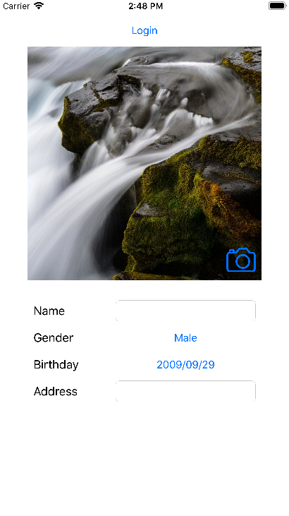
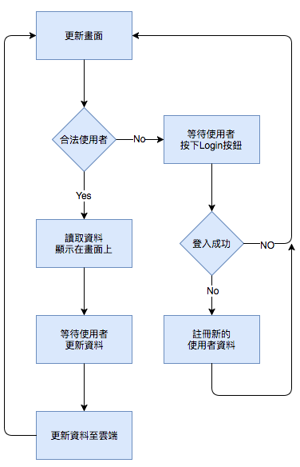

# Droi\_Sample\_UserProfile\_iOS

`Droi_Sample_UserProfile_iOS`是個功能簡單的專案。主要示範如何使用自定義的`DroiUser`來完成延伸資料的載入及儲存。

## 專案架構


### 函式庫需求
* DroiBaaS - [DroiBaaS](https://www.droibaas.com)
* DatePickerDialog-ObjC - 一個簡單使用的DatePicker控制元件。[這裡](https://github.com/gameleon-dev/DatePickerDialog-iOS-ObjC)

*Podfile*

```ruby 
target "Droi_Sample_UserProfile_iOS" do
	pod 'DroiCoreSDK'
	pod 'DatePickerDialog-ObjC', '~> 1.2'

	post_install do |installer|
		require './Pods/DroiCoreSDK/scripts/postInstall.rb'
		DroiCoreParser.installParser()
	end
end
``` 


## 控制流程
基本的使用者註冊及登入可以參考[BTD]說明。此示例主要展示簡單的自定義`DroiUser`的方式，以及上傳、更新資料及頭像等功能。以下就不同的功能展示做一些介紹。  

. 


### <a id="Login"></a>建立及登入使用者
使用`login`登入所指定的使用者帳號，如果回傳值錯誤值為`DROICODE_USER_NOT_EXISTS`時，代表該位使用者尚未註冊，此時就需要使用`signUp`註冊所指定的使用者帳號。相對的代碼如下：

```objc
// 登入使用者
[DroiUser loginByUserClassInBackground:@"TestUserIOS" password:@"PASSWORD" userClass:MyUser.class callback:^(DroiUser *user, DroiError *error) {
        if ( error.isOk ) {
            // Login OK
            dispatch_async( dispatch_get_main_queue(), ^{
                [self refreshUI];
            });
        } else if (error.code == DROICODE_USER_NOT_EXISTS ) {
            // SignUp
            MyUser* user = [MyUser new];
            user.name = @"MyUser";
            user.birthday = [NSDate date];
            user.address = @"Address";
            user.gender = NO;
            
            // Default icon to byte array
            UIImage* image = [UIImage imageNamed:@"Camera"];
            NSData* bitmapdata = UIImageJPEGRepresentation(image, 0.8f);
            user.photo = [DroiFile fileWithData:bitmapdata];
            
            // Create a new MyUser
            user.UserId = @"TestUserIOS";
            user.Password = @"PASSWORD";
            
            [user signUpInBackground:^(BOOL result, DroiError *error) {
                if ( error.isOk ) {
                    dispatch_async( dispatch_get_main_queue(), ^{
                        [self refreshUI];
                    });
                } else {
                    self.btnLogin.userInteractionEnabled = YES;
                }
            }];
        } else {
            self.btnLogin.userInteractionEnabled = YES;
        }
    }];
```

### 修改使用者資料
簡單來說，更新使用者資料的方式只需要修改資料之後直接呼叫`DroiUser:save`即可以將變更的資料上傳至服務器端。上傳/更新使用者資料的代碼如下：

```objc
- (void) updateDataInBackground:(MyUser*) user {
    [user saveInBackground:^(BOOL result, DroiError *error) {
        NSLog( @"Updated. Result is %d", error.isOk );
    }];
}
```

### 上傳或更新使用者頭像
使用者頭像的上傳方式有二段程式碼需要注意。第一個部份就是當使用者登入帳號時，發現該使用者之前沒有註冊過，程式會自動上傳預設的頭像以及執行signUp的動作，此段代碼如同[建立及登入使用者](#Login)所示。  
至於第二個部份就是使用者更換頭像時，如果該欄位已有設置過頭像。則選擇使用`DroiFile:update`的方式更換頭像；反之則使用`DroiFile:save`的接口建立頭像資料。相關代碼如下所示：   
**此處需要注意使用`DroiFile:update`更新資料之後，需要呼叫`DroiUser:save`更地本地端的緩存，以避免雲端及本地端資料不同步的問題**

```objc
MyUser* user = [DroiUser getCurrentUserByUserClass:MyUser.class];
if ( user.photo == nil ) {
        // 建立新的DroiFile
        user.photo = [DroiFile fileWithData:bitmapdata];
        [self updateDataInBackground:user];
    } else {
        // 已存在頭像資料。直接更新頭像資料
        [user.photo updateDataInBackground:bitmapdata callback:^(BOOL result, DroiError *error) {
            NSLog( @"Update photo data. Result is %d, %@", error.isOk, error );
            
            // 更新完成並一併更新本地Current User緩存
            [user saveInBackground:nil];
        }];
    }
}
```


